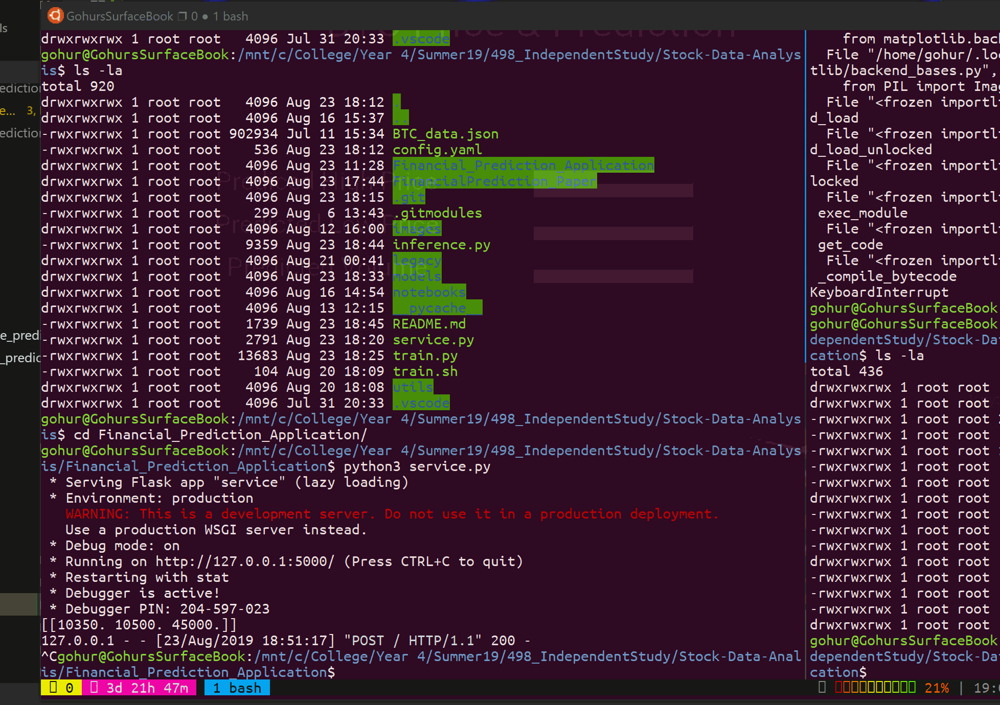

# Stock-Data-Analysis

In this study, we look at cryptocurrency and stock price prediction by utilizing machine learning methods. We look at primary types of neural networks such as multi-layer perceptrons, temporal convolutional neural networks, and long-term-short-term memory recurrent neural networks.   

## Getting Started with the Machine Learning

### Dependencies
This project requires you to install the following packages:
* `torch`
* `numpy`
* `pandas`
* `matplotlib`
* `pyyaml`
* `tqdm`
* `flask`
* `cryptocompare`

You may use `pip` or `conda` to install these packages.

For Jupyter Notebooks, you can install Jupyter or you can open them here: https://colab.research.google.com/

### Project Design, Planning, and Prototyping

The project's planning phase and testing occured in jupyter notebooks, located in the `notebooks/` directory. They were run in Google Colaboratory which allows us to utilize a NVIDIA Tesla T4 GPU for training. 

### Training 
```
$ python3 train.py --save-model --state-dict --output-dir models/
```

Changes can be made to the `config.yaml` to alter the model's hyperparameters.

You can enter your preferred configuration of this command into `train.sh` for easier execution.

If you have an NVIDIA GPU available, its recommended to utilize in order to accelerate training,
however, this is not required. You may utilize Google Colab in order to run the code and transfer the traing model to 
your local machine for inference. 

### Inference

Inference/live prediction can be run in the command like the following:

```
$ python3 inference.py --trnn --low 10400 --high 10500 --volume 45000
>>> BTC prediction:  [tensor([[10151.8418]])]
```

## Getting Started with the Application
This project requires you to install the following packages:
* `torch`
* `numpy`
* `pandas`
* `matplotlib`
* `pyyaml`
* `tqdm`
* `flask`
* `cryptocompare`

You may use `pip` or `conda` to install these packages.

You also need to install `kivy`, which you can follow at this website:  
https://kivy.org/doc/stable/installation/installation-windows.html

## Opening the application

After installing kivy, you can easily open the desktop application like so:
```
$ python3 MyApp.py
```

In order to get predictions please also make sure the webservice is running.
```
$ python3 service.py
```

## About the application

This application allows the user to get the current price of Bitcoin and be able to use
their trained model in order to predict what the price will be the next day. The user
may choose to train and update the current model that the application uses and can alter
the model's hyperparameters if they feel that they need to be updated. Once the model is ready
they user inputs the high, low, and volume that they feel will be tomorrow's BTC stats, then the
model outputs its prediction.

When getting predictions, the model named `price_predictor.pt` will be opened.
Additionally, any changes to the application's `config.yaml` will require the
application to be re-executed for the changes to take effect.

## Demo



Here's a demo of the application, for the purposes of the demo, we demo a lightly trained model.


### Helpful Links
https://colah.github.io/posts/2015-08-Understanding-LSTMs/  
https://github.com/borisbanushev/stockpredictionai#thedata